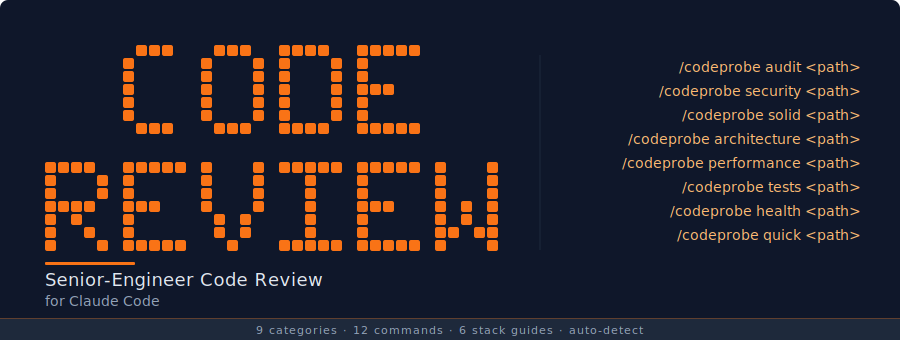

# CodeProbe

<p align="center">
  
</p>

Senior-Engineer Code Review for [Claude Code](https://docs.anthropic.com/en/docs/claude-code).

Reads your codebase, generates severity-scored findings across 9 categories -- security, SOLID principles, architecture, error handling, performance, test quality, code smells, design patterns, and framework best practices -- each with a copy-pasteable fix prompt you can run directly in Claude Code. **Strictly read-only: never modifies your code.**

## Quick Start

### One-Command Install (macOS/Linux)

```bash
curl -fsSL https://raw.githubusercontent.com/nishilbhave/code-review-claude/main/install.sh | bash
```

### Manual Install

```bash
git clone https://github.com/nishilbhave/code-review-claude.git
cd code-review-claude
./install.sh
```

### Windows (Git Bash)

Requires [Git for Windows](https://gitforwindows.org/) which includes Git Bash.

```bash
# Option 1: One-command install (run from Git Bash, not PowerShell/CMD)
curl -fsSL https://raw.githubusercontent.com/nishilbhave/code-review-claude/main/install-win.sh | bash

# Option 2: Manual install
git clone https://github.com/nishilbhave/code-review-claude.git
cd code-review-claude
./install-win.sh
```

> **Note:** Right-click the folder and select "Open Git Bash here", or open Git Bash and navigate to the directory. Do not use PowerShell or Command Prompt.

### Requirements

- [Claude Code](https://docs.anthropic.com/en/docs/claude-code) CLI
- Python 3.8+ (optional -- enables `/codeprobe health` statistics)

Then in any project:

```
/codeprobe audit .
```

## Available Commands

| Command | Description | Status |
|---------|-------------|--------|
| `/codeprobe audit <path>` | Full audit -- all 9 categories, detailed findings, refactoring roadmap | Available |
| `/codeprobe solid <path>` | SOLID principles analysis | Available |
| `/codeprobe security <path>` | Security vulnerability detection | Available |
| `/codeprobe smells <path>` | Code smell detection | Available |
| `/codeprobe architecture <path>` | Architecture and dependency analysis | Available |
| `/codeprobe patterns <path>` | Design patterns analysis | Available |
| `/codeprobe performance <path>` | Performance audit | Available |
| `/codeprobe errors <path>` | Error handling audit | Available |
| `/codeprobe tests <path>` | Test quality audit | Available |
| `/codeprobe framework <path>` | Framework best practices | Available |
| `/codeprobe quick <path>` | Top 5 most impactful issues with fix prompts | Available |
| `/codeprobe health <path>` | Codebase vitals dashboard -- scores + file statistics | Available |
| `/codeprobe diff [branch]` | PR-style review of changed files | Phase 3 |
| `/codeprobe report` | Generate report from last audit | Phase 3 |

If no path is given, the current working directory is used.

## How It Works

The system uses an **orchestrator + sub-skill** architecture:

1. **Orchestrator** (`skills/codeprobe/SKILL.md`) -- Routes commands, detects your tech stack, loads config, and invokes specialized sub-skills.
2. **Sub-skills** -- Domain experts that each analyze one category:
   - `codeprobe-security` -- SQL injection, XSS, hardcoded secrets, auth issues
   - `codeprobe-error-handling` -- Swallowed exceptions, missing try/catch, transaction safety
   - `codeprobe-solid` -- Single Responsibility, Open/Closed, Liskov, Interface Segregation, Dependency Inversion
   - `codeprobe-architecture` -- Coupling, layering violations, circular dependencies, god objects
   - `codeprobe-patterns` -- Design pattern opportunities and anti-patterns
   - `codeprobe-performance` -- N+1 queries, unbounded queries, algorithmic efficiency, caching
   - `codeprobe-code-smells` -- Long methods, deep nesting, duplicate code, primitive obsession
   - `codeprobe-testing` -- Missing tests, test smells, mock abuse, coverage gaps
   - `codeprobe-framework` -- Laravel, React/Next.js, Python/Django framework idiom violations
3. **Reference guides** (`skills/codeprobe/references/`) -- Stack-specific best practices loaded based on auto-detected languages.
4. **Scripts** (`skills/codeprobe/scripts/`) -- Deterministic analysis utilities:
   - `file_stats.py` -- LOC, file counts, method counts per file
   - `complexity_scorer.py` -- Cyclomatic complexity per function
   - `dependency_mapper.py` -- Import graph and circular dependency detection
   - `generate_report.py` -- Markdown report generation from audit findings

Stack detection is automatic. The orchestrator scans for file extensions and project markers (e.g., `next.config.*`, `migrations/` directory) and loads the appropriate reference guides.

## Output Format

Every finding follows a consistent format:

```
### SEC-003 | Critical | `src/auth/login.php:22-35`

**Problem:** SQL query built with string concatenation using unsanitized user input.

**Evidence:**
> Line 25: `$query = "SELECT * FROM users WHERE email = '" . $_POST['email'] . "'";`

**Suggestion:** Use parameterized queries via PDO prepared statements.

**Fix prompt:**
> Refactor `src/auth/login.php` lines 22-35 to use PDO prepared statements
> instead of string concatenation for the SQL query.
```

Each finding includes: ID, severity, file location, problem description, evidence from the code, suggestion, and a fix prompt you can paste directly into Claude Code.

## Configuration

Create a `.codeprobe-config.json` in your project root to customize behavior:

```json
{
  "severity_overrides": {
    "long_method_loc": 50,
    "large_class_loc": 500,
    "deep_nesting_max": 4,
    "max_constructor_deps": 6
  },
  "skip_categories": ["codeprobe-testing"],
  "skip_rules": ["SPEC-GEN-001"],
  "framework": "laravel",
  "extra_references": [],
  "report_format": "markdown"
}
```

All fields are optional. If the file is absent, defaults apply.

## Scoring

Each category is scored independently:

```
category_score = max(0, 100 - (critical * 25) - (major * 10) - (minor * 3))
```

Suggestions do not affect scores. The overall score is a weighted average of active categories:

| Category | Weight |
|----------|--------|
| Security | 20% |
| SOLID | 15% |
| Architecture | 15% |
| Error Handling | 12% |
| Performance | 12% |
| Test Quality | 10% |
| Code Smells | 8% |
| Design Patterns | 4% |
| Framework | 4% |

All 9 categories are active. If `skip_categories` is set in config, weights are normalized to 100%.

| Score Range | Status |
|-------------|--------|
| 80-100 | Healthy |
| 60-79 | Needs Attention |
| 0-59 | Critical |

## Stack Support

Auto-detected languages and frameworks with dedicated reference guides:

- **Python** -- PEP standards, Django/Flask patterns, type hinting
- **JavaScript / TypeScript** -- ES modules, async patterns, type safety
- **React / Next.js** -- Component patterns, hooks, SSR/SSG
- **PHP / Laravel** -- Eloquent, service patterns, blade templates
- **SQL / Database** -- Query optimization, schema design, migrations
- **API Design** -- REST conventions, validation, error responses

Additional languages recognized for file statistics: Java, Ruby, Go, Rust, Vue, Svelte, Shell, CSS/SCSS, HTML.

## Claude.ai Support

When used on Claude.ai (without filesystem access), the skill runs in **degraded mode**: it analyzes pasted or uploaded code directly, skips codebase statistics and diff review, and notes the limitation. Findings and scoring still work normally.

## Phase Roadmap

**Phase 1 (complete):** Core review engine with 4 sub-skills (security, SOLID, architecture, code smells), orchestrator routing, scoring, templates, and file statistics.

**Phase 2 (current):** 5 additional sub-skills (error handling, performance, test quality, design patterns, framework best practices), 3 additional scripts (complexity scorer, dependency mapper, report generator), and PR review template.

**Phase 3:** Parallel agent execution, PDF report generation, CI integration, and diff-based reviews.

## License

MIT

## Author

Nishil
